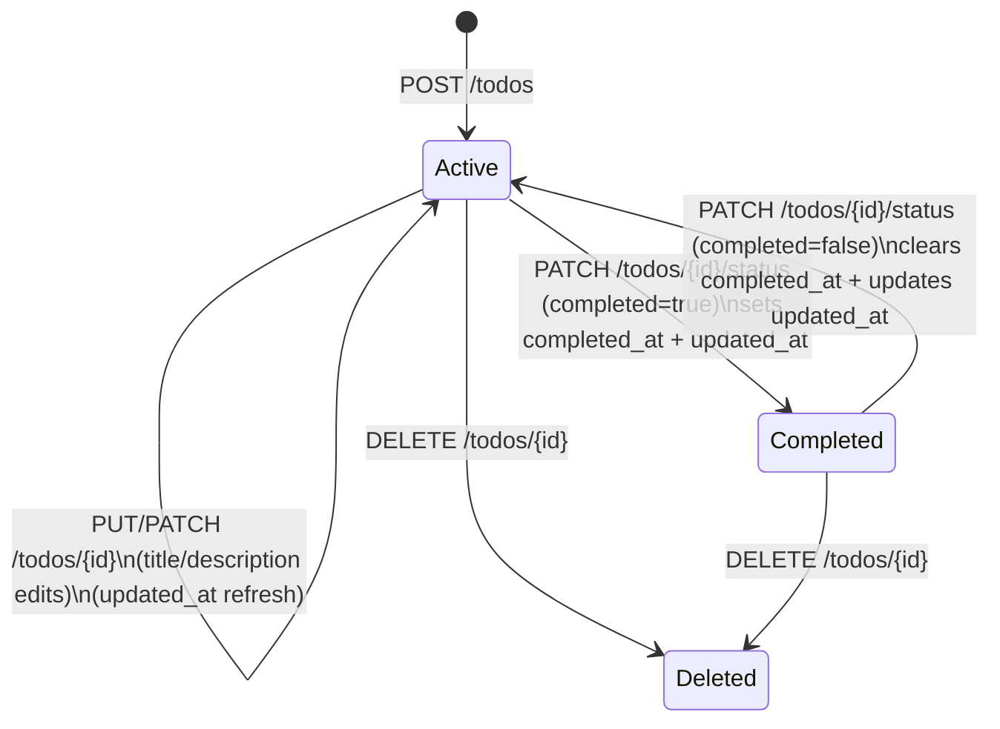

# Data Model: TODO 기본 관리
_Updated: 2025-11-11_

## Entities Overview

| Entity | Description | Notes |
|--------|-------------|-------|
| `TodoItem` | 단일 사용자의 할 일 레코드 (CRUD + 완료 토글 대상) | 모든 엔드포인트가 이 엔티티 하나만 다룬다. |

No additional entities (users, tags, etc.) are in scope for v1 per specification.

## TodoItem Schema

| Column | Type | Constraints | Purpose |
|--------|------|-------------|---------|
| `id` | TEXT (UUID v4) | PK, NOT NULL | Stable identifier returned to clients. |
| `title` | TEXT | NOT NULL, 1~200 chars | 간단한 작업 제목. |
| `description` | TEXT | NULLABLE, ≤2000 chars | 상세 설명. |
| `completed` | INTEGER (0/1 bool) | NOT NULL, default 0 | 완료 여부. |
| `created_at` | DATETIME (UTC) | NOT NULL | 생성 시각, 서버에서만 설정. |
| `updated_at` | DATETIME (UTC) | NOT NULL | 마지막 수정 시각; 완료 토글 포함 모든 변경 시 갱신. |
| `completed_at` | DATETIME (UTC) | NULLABLE | 완료된 경우에만 timestamp, 미완료면 NULL. |

Indexes:
- `idx_todos_created_at_desc` on (`created_at` DESC) to serve list endpoint ordering efficiently.

## Relationships
- None (single-entity design). Foreign keys will be introduced once multi-user support arrives.

## Lifecycle & State Transitions

- `completed` boolean tracks Active vs Completed.
- `completed_at` mirrors the Completed state timestamp; cleared when reverting to Active.
- `updated_at` refreshes on **all** mutations (per clarification).

## Data Volume & Retention
- Expected < 100 rows per user; SQLite single-table is sufficient.
- No automatic retention/archival; DELETE removes rows permanently.

## Validation Rules (enforced via Pydantic + service layer)
- `title`: strip whitespace, ensure length between 1 and 200.
- `description`: optional; if provided, strip whitespace and enforce ≤2000.
- `completed_at`: MUST be null when `completed=false`.
- `created_at`/`updated_at`: timezone-aware UTC ISO strings in API responses.

## Migration Plan
- Alembic revision `0001_create_todos` creates table/index above.
- Future revisions will add columns (e.g., due_date) while keeping backward compatibility through nullable defaults.
